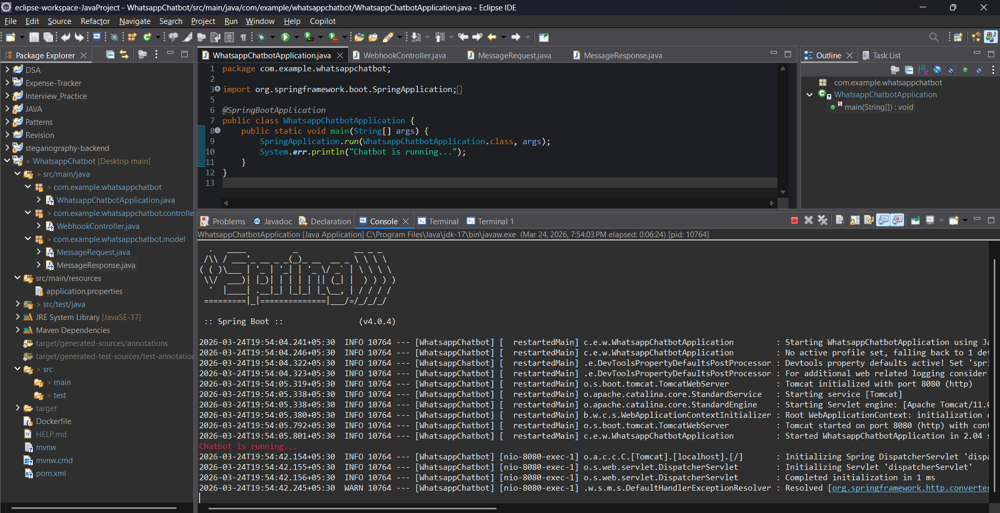
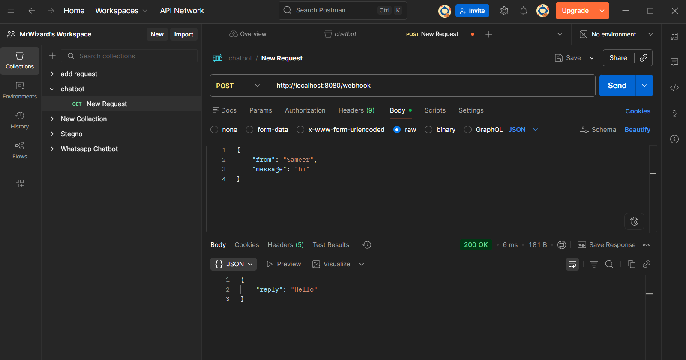
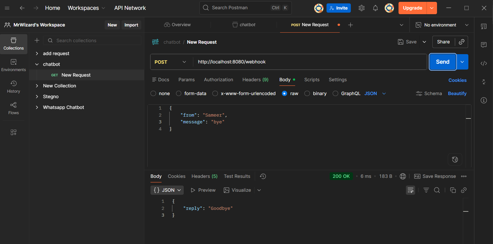

# Simple WhatsApp Chatbot (Spring Boot)

A basic WhatsApp chatbot built using Java Spring Boot that can receive and respond to messages in real-time using Spring boot API.

## 🚀 Features
- Send & receive WhatsApp messages
- Automated replies
- REST API using Spring Boot
- Beginner-friendly project

## 🛠️ Tech Stack
- Java
- Spring Boot
- Twilio API
- Maven

## 📸 Screenshots

### 1. Springboot Logs


### 2. Response for "Hi"


### 3. Response for "Bye"


## 📦 Installation

```bash
git clone https://github.com/sameerturkar/Simple-WhatsApp-chatbot.git
cd Simple-WhatsApp-chatbot
